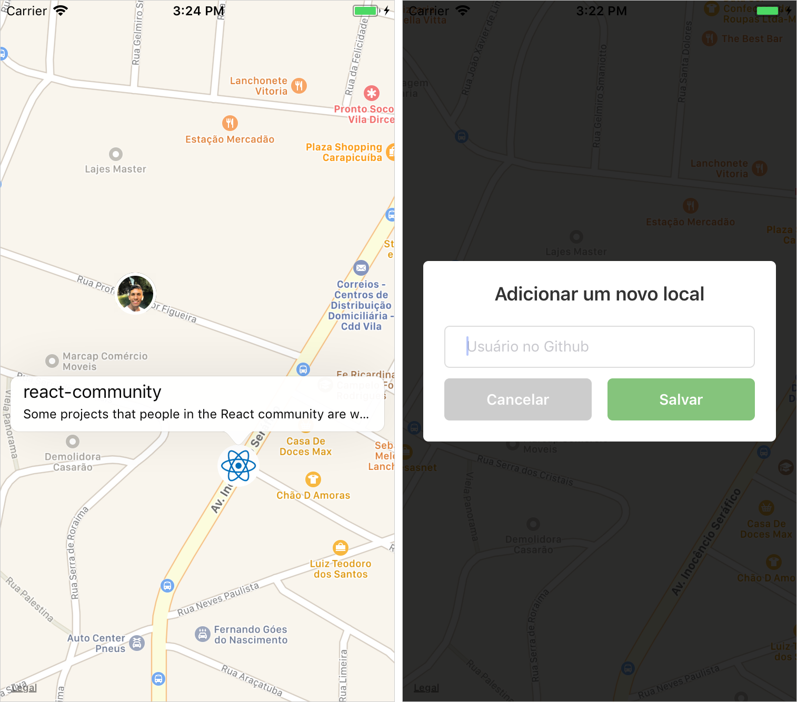

# GitMapView App

Learning and testing maps with [react-native-maps](https://github.com/react-community/react-native-maps) and [GitHub API](https://developer.github.com/)



## Prerequisites

- [NodeJs](https://nodejs.org/en/)
- [React Native](https://facebook.github.io/react-native/docs/getting-started.html)

## Install

1. Open Terminal
2. Clone this repository
3. Go to the project folder
4. Install dependencies
```
git clone https://github.com/drimarques/gitmapview.git
cd gitmapview
npm install
```

## Run

`react-native start`

`react-native run-ios` or `react-native run-android`